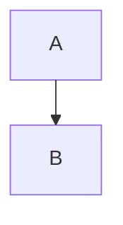
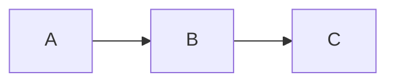
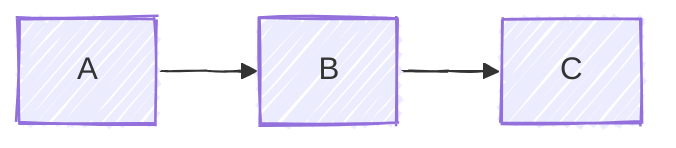
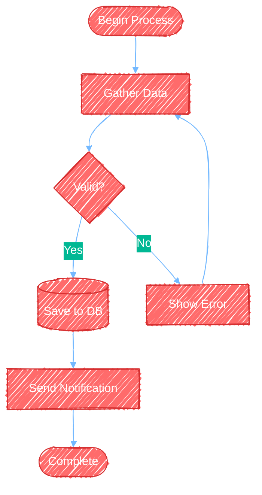
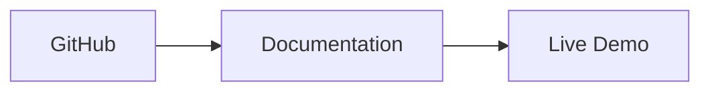
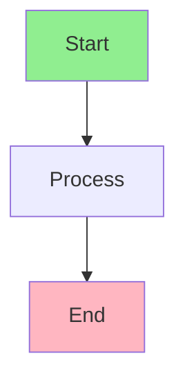
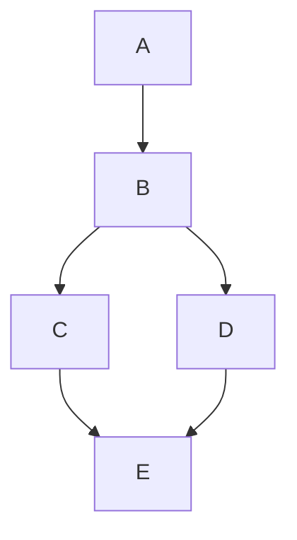
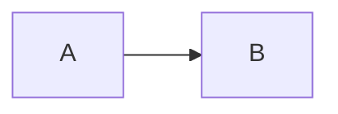

# Advanced Mermaid Features

Configuration, layout options, and integration patterns for creating professional diagrams.

<example name="Layout: Dagre Default">

## Layout Options

### Dagre Layout (Default)


</example>

<example name="Layout: ELK Advanced">

### ELK Layout (Advanced)

For complex diagrams with better automatic layout:



**ELK node placement strategies:**
- `SIMPLE` - Basic placement
- `NETWORK_SIMPLEX` - Network optimization
- `LINEAR_SEGMENTS` - Linear arrangement
- `BRANDES_KOEPF` - Balanced (default)

</example>

<example name="Look: Classic">

## Look Options

### Classic Look

Traditional Mermaid appearance:



</example>

<example name="Look: Hand-Drawn">

### Hand-Drawn Look

Sketch-like, informal style:



</example>

<example name="Complete Configuration">

## Complete Configuration Example



</example>

<example name="Click Events">

## Click Events and Links

Add interactive elements:



</example>

<example name="Tooltips">

## Tooltips

Add hover information:

```mermaid
flowchart LR
    A[Service A]
    B[Service B]

    A -.->|REST API| B

    %% Tooltips are defined with links
    link A: API Documentation @ https://api.example.com
    link B: Service Dashboard @ https://dashboard.example.com
```

</example>

<example name="Comments">

## Comments and Documentation



</example>

<example name="Directional Hints">

## Directional Hints

Control layout direction for specific nodes:



</example>

## Responsive Sizing

Use CSS to make diagrams responsive:

```html
<div style="max-width: 100%; overflow: auto;">
    <pre class="mermaid">
        flowchart LR
            A --> B --> C
    </pre>
</div>
```

## SVG Export Options

When exporting to SVG:

```bash
# Export with custom dimensions
mmdc -i diagram.mmd -o output.svg -w 1920 -H 1080

# Export with background color
mmdc -i diagram.mmd -o output.svg -b "#ffffff"

# Export with transparent background
mmdc -i diagram.mmd -o output.svg -b "transparent"
```

<example name="Performance: Large Diagrams">

## Performance Considerations

For large diagrams:

```mermaid
---
config:
  layout: elk
  elk:
    mergeEdges: true
---
flowchart TD
    %% ELK handles complex layouts better
    %% Merge edges reduces visual clutter
```

**Performance tips:**
- Use ELK layout for diagrams with >20 nodes
- Enable edge merging for simplified connections
- Split very large diagrams into multiple focused views
- Consider using subgraphs to organize complexity
- Limit styling to essential elements

</example>

<example name="Integration: Markdown">

## Integration Examples

### Markdown Files

````markdown
# System Architecture


````

</example>

<example name="Integration: HTML">

### HTML Files

```html
<!DOCTYPE html>
<html>
<head>
    <script type="module">
        import mermaid from 'https://cdn.jsdelivr.net/npm/mermaid@10/dist/mermaid.esm.min.mjs';
        mermaid.initialize({
            startOnLoad: true,
            theme: 'dark',
            look: 'handDrawn'
        });
    </script>
</head>
<body>
    <pre class="mermaid">
        flowchart LR
            A --> B
    </pre>
</body>
</html>
```

</example>

<example name="Integration: React">

### React Components

```jsx
import React from 'react';
import mermaid from 'mermaid';

mermaid.initialize({
    startOnLoad: true,
    theme: 'forest'
});

function DiagramComponent() {
    React.useEffect(() => {
        mermaid.contentLoaded();
    }, []);

    return (
        <div className="mermaid">
            flowchart LR
                A --> B
        </div>
    );
}
```

</example>

## Best Practices for Advanced Features

1. **Use ELK for complex layouts** - When dagre creates crossed lines
2. **Comment complex configurations** - Explain non-obvious styling choices
3. **Test exports** - Verify diagrams render correctly in target format
4. **Use subgraphs** - Organize complexity into logical groups
5. **Keep configs versioned** - Track configuration changes in your repository
