# Class Diagrams

Class diagrams model object-oriented designs and domain models. They show entities (classes), their attributes/methods, and relationships.

## Contents

- [Basic Syntax](#basic-syntax)
- [Defining Classes with Members](#defining-classes-with-members)
- [Relationships](#relationships) (Association, Composition, Aggregation, Inheritance, Dependency, Realization)
- [Multiplicity](#multiplicity)
- [Relationship Labels](#relationship-labels)
- [Class Stereotypes](#class-stereotypes)
- [Abstract Classes and Methods](#abstract-classes-and-methods)
- [Generic Classes](#generic-classes)
- [Comprehensive Example: E-Commerce Domain](#comprehensive-example-e-commerce-domain)
- [Domain-Driven Design Patterns](#domain-driven-design-patterns)
- [Tips for Effective Class Diagrams](#tips-for-effective-class-diagrams)
- [Common Patterns](#common-patterns) (Repository, Factory, Strategy)

<example name="Basic Syntax">

## Basic Syntax

```mermaid
classDiagram
    ClassName
```

</example>

<example name="Class with Members">

## Defining Classes with Members

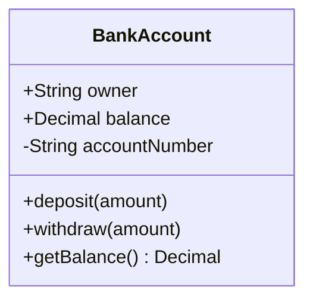

**Visibility modifiers:**
- `+` Public
- `-` Private
- `#` Protected
- `~` Package/Internal

**Member syntax:**
- `+type attribute` - Attribute with type
- `+method(params) ReturnType` - Method with parameters and return type

</example>

## Relationships

<example name="Association">

### Association (`--`)
Loose relationship where entities use each other but exist independently.

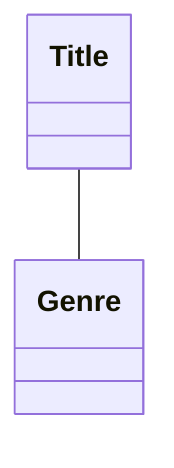

</example>

<example name="Composition">

### Composition (`*--`)
Strong ownership - child cannot exist without parent. When parent is deleted, children are deleted.

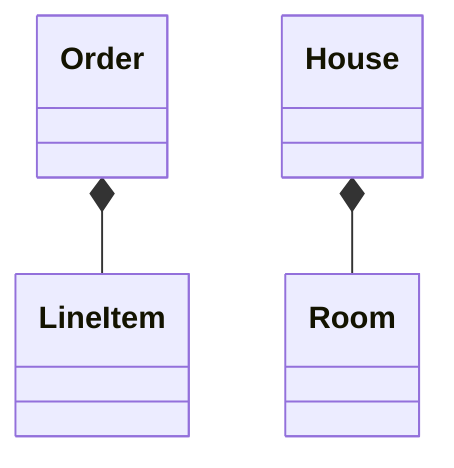

</example>

<example name="Aggregation">

### Aggregation (`o--`)
Weaker ownership - child can exist independently. Represents "has-a" relationship.

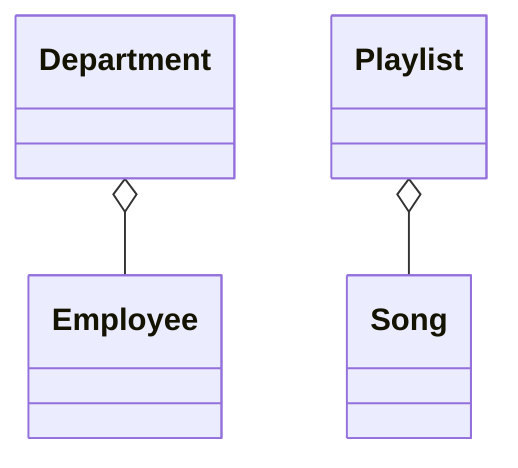

</example>

<example name="Inheritance">

### Inheritance (`<|--`)
"Is-a" relationship. Child class inherits from parent class.

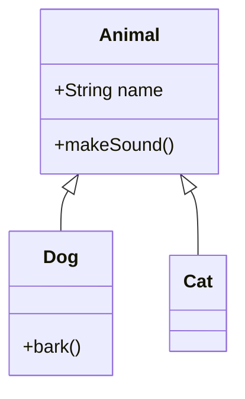

</example>

<example name="Dependency">

### Dependency (`<..`)
One class depends on another, often as a parameter or local variable.

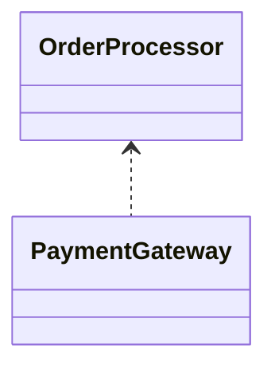

</example>

<example name="Realization">

### Realization/Implementation (`<|..`)
Class implements an interface.

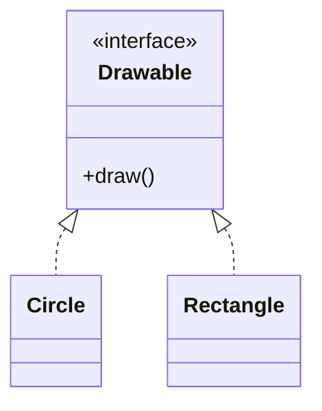

</example>

<example name="Multiplicity">

## Multiplicity

Show how many instances participate in a relationship:

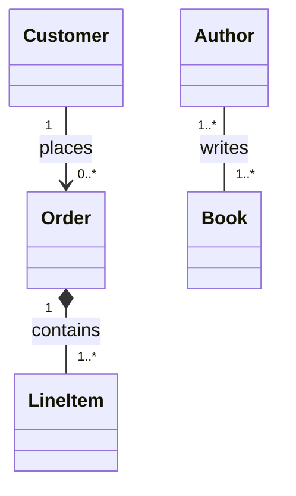

**Common multiplicities:**
- `1` - Exactly one
- `0..1` - Zero or one
- `0..*` or `*` - Zero or many
- `1..*` - One or many
- `m..n` - Between m and n

</example>

<example name="Relationship Labels">

## Relationship Labels

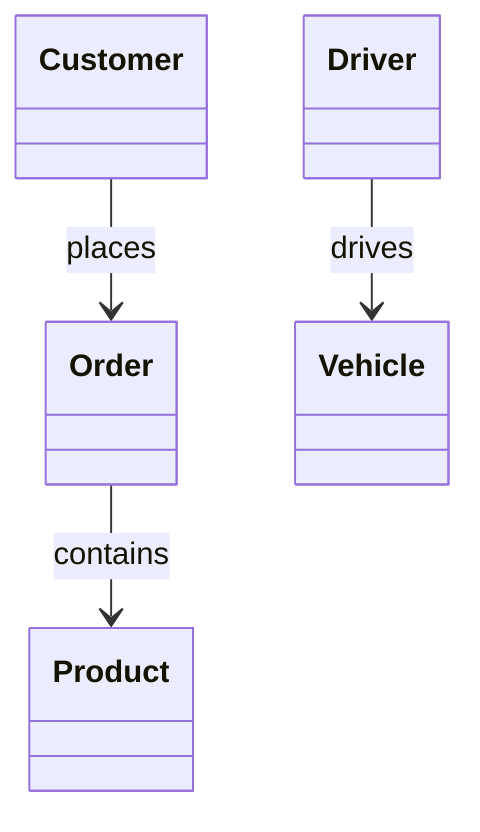

</example>

<example name="Stereotypes">

## Class Stereotypes

Mark special class types:

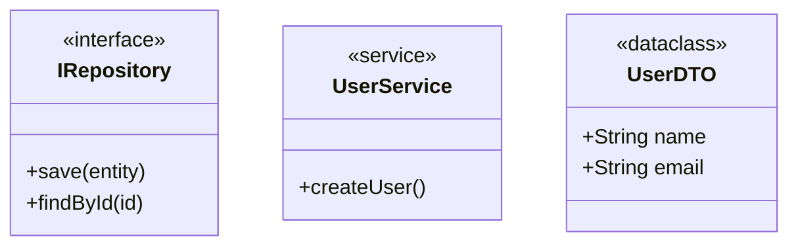

</example>

<example name="Abstract Classes">

## Abstract Classes and Methods

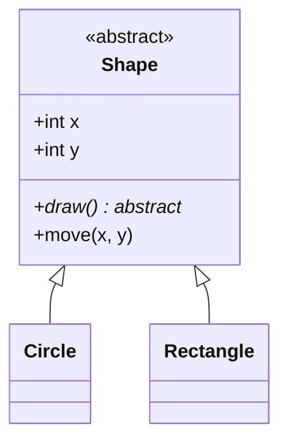

</example>

<example name="Generics">

## Generic Classes

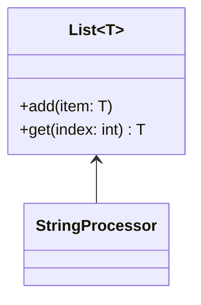

</example>

<example name="E-Commerce Domain">

## Comprehensive Example: E-Commerce Domain

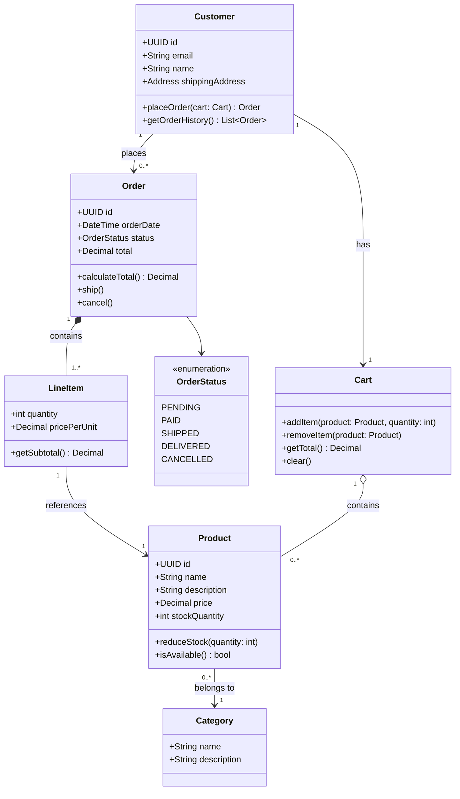

</example>

## Domain-Driven Design Patterns

<example name="DDD Entity">

### Entities
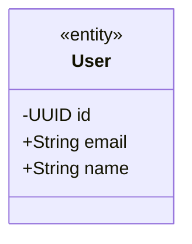

</example>

<example name="DDD Value Objects">

### Value Objects
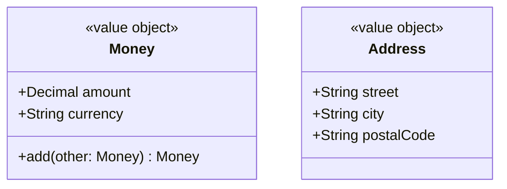

</example>

<example name="DDD Aggregates">

### Aggregates
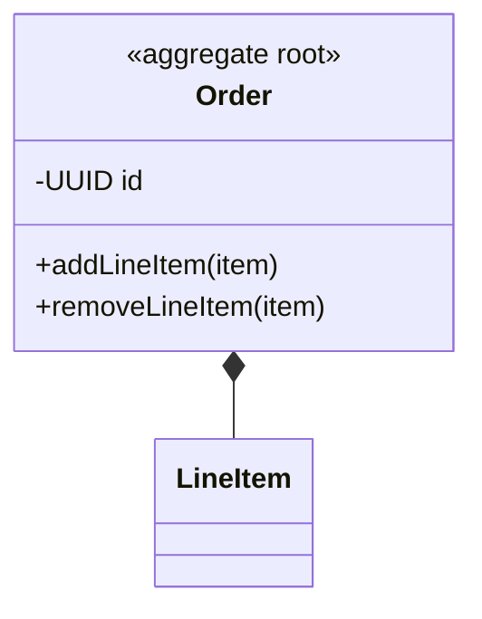

</example>

## Tips for Effective Class Diagrams

1. **Start with core entities** - Add attributes and methods incrementally
2. **Show only relevant details** - Omit obvious getters/setters unless important
3. **Use appropriate relationships** - Choose between association, aggregation, and composition carefully
4. **Add multiplicity** - Clarifies how many instances participate
5. **Group related classes** - Use notes or visual proximity
6. **Document invariants** - Use notes to explain business rules

## Common Patterns

<example name="Repository Pattern">

### Repository Pattern
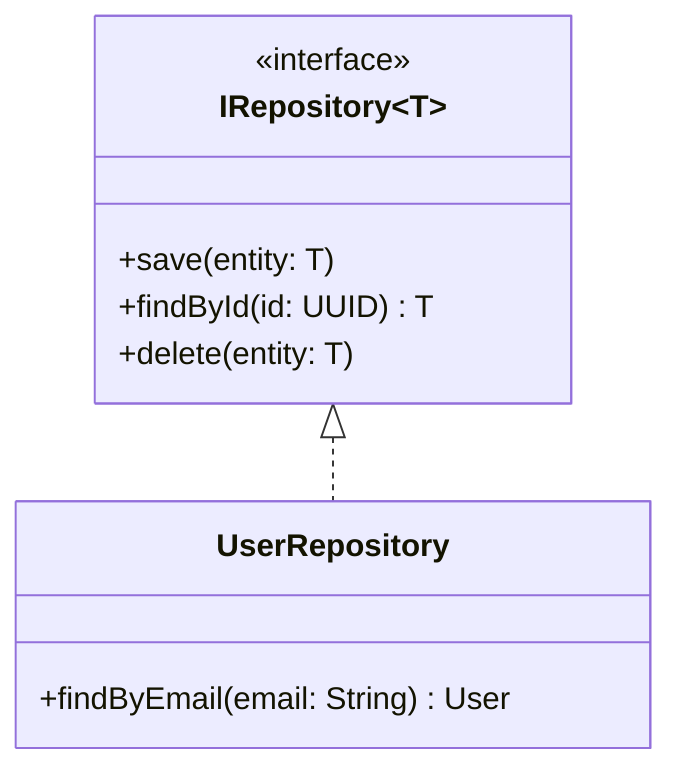

</example>

<example name="Factory Pattern">

### Factory Pattern
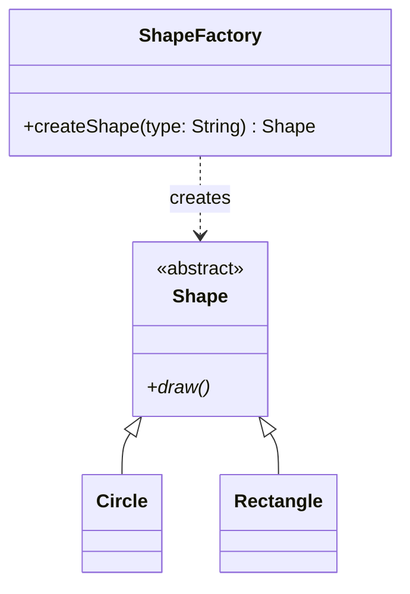

</example>

<example name="Strategy Pattern">

### Strategy Pattern
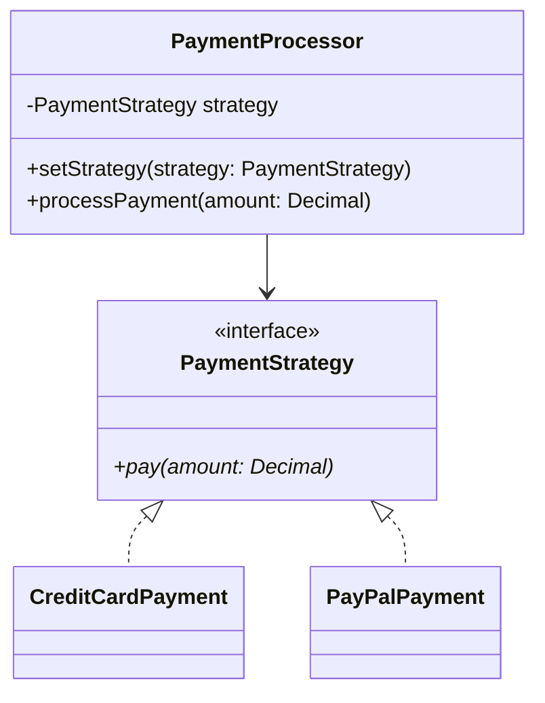

</example>
