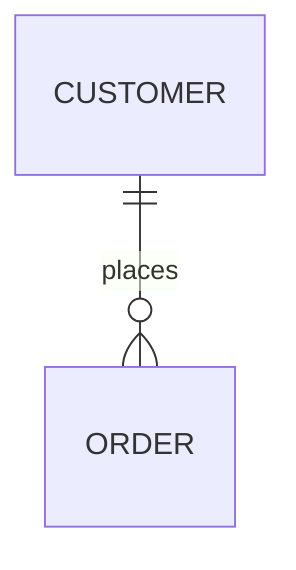
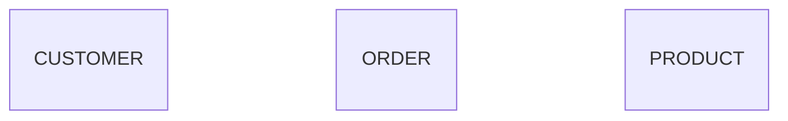
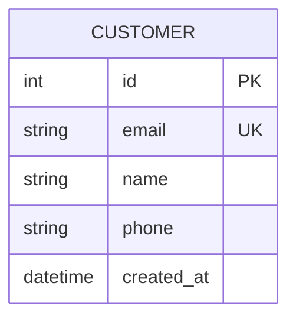
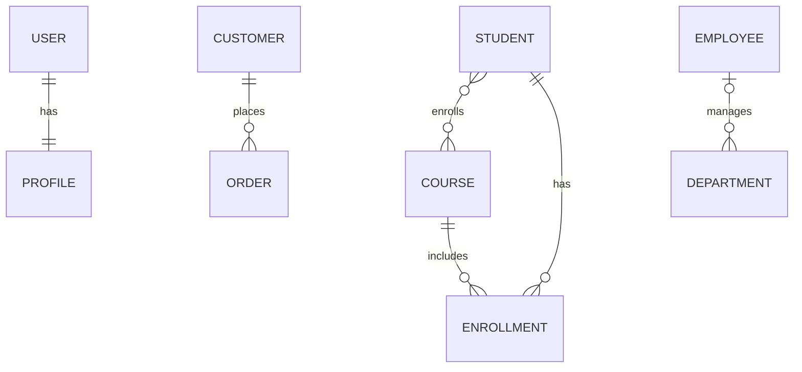
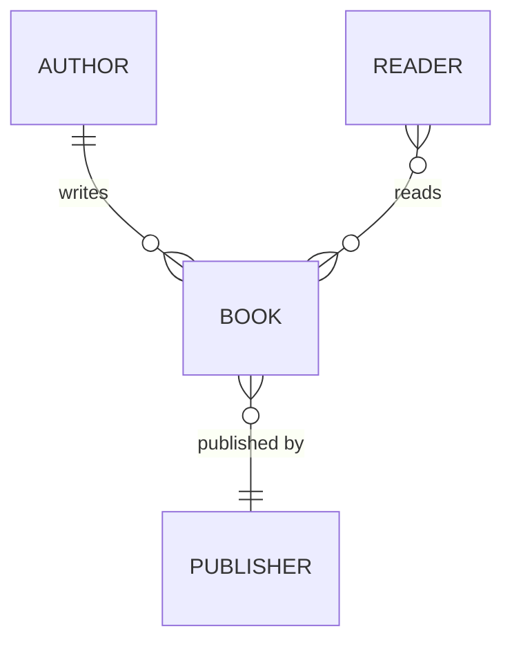
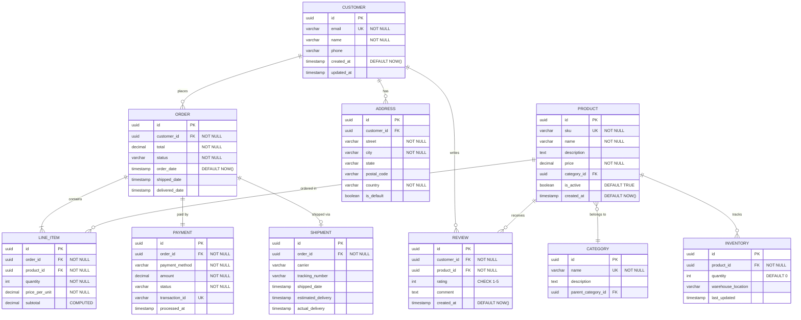

# Entity Relationship Diagrams - Basics

ERDs model database schemas, showing tables (entities), their columns (attributes), and relationships between tables. Essential for database design and documentation.

<example name="Basic Syntax">

## Basic Syntax

</example>

<example name="Entities">

## Defining Entities

</example>

<example name="Entity Attributes">

## Entity Attributes

Define columns with type and constraints:

**Attribute format:** `type name constraints`

**Common constraints:**
- `PK` - Primary Key
- `FK` - Foreign Key
- `UK` - Unique Key

</example>

## Relationships

### Relationship Symbols

**Cardinality indicators:**
- `||` - Exactly one
- `|o` - Zero or one
- `}|` / `|{` - One or many
- `}o` - Zero or many

**Relationship line:**
- `--` - Non-identifying relationship
- `..` - Identifying relationship (rare in practice)

<example name="Common Relationships">

### Common Relationships

</example>

<example name="Relationship Labels">

### Relationship with Labels

</example>

## Data Types

Use standard database types:
- `int`, `bigint`, `smallint`
- `varchar`, `text`, `char`
- `decimal`, `float`, `double`
- `boolean`, `bool`
- `date`, `datetime`, `timestamp`
- `json`, `jsonb`
- `uuid`
- `blob`, `bytea`

<example name="E-Commerce Database">

## Comprehensive Example: E-Commerce Database

</example>
