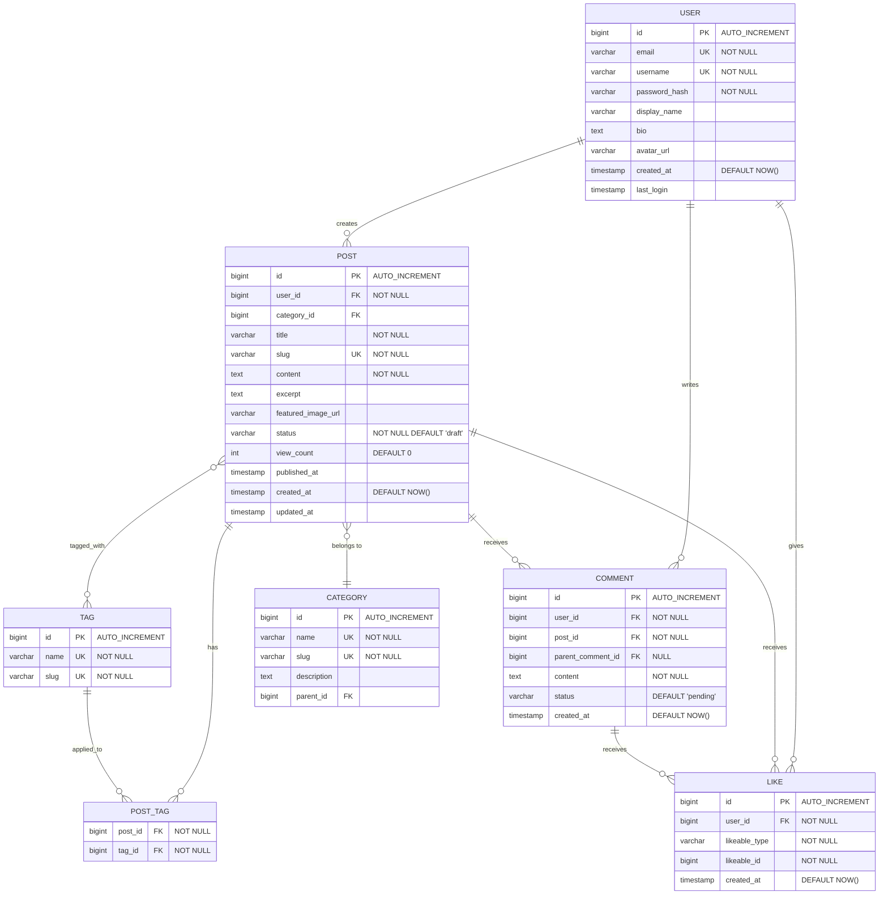
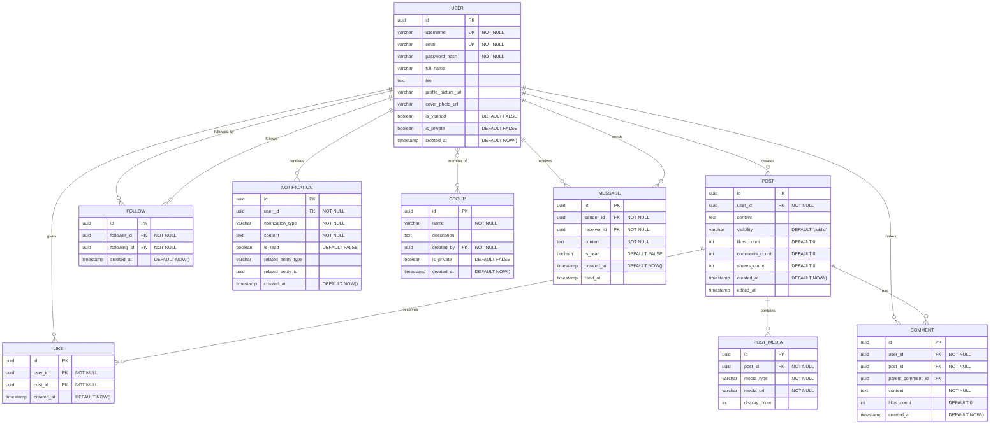
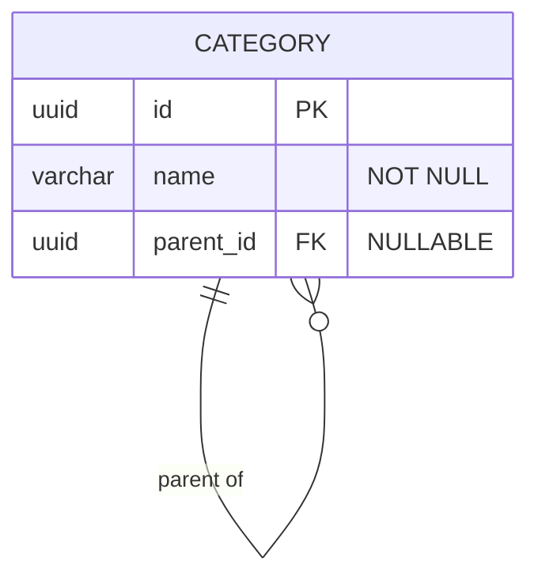
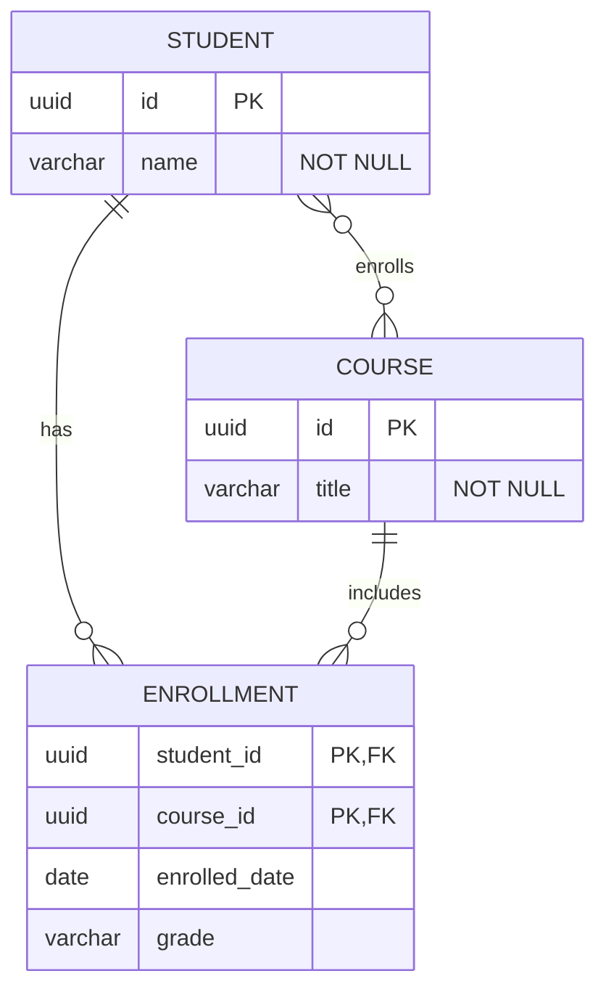
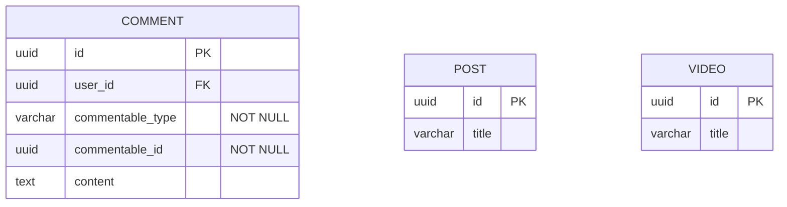
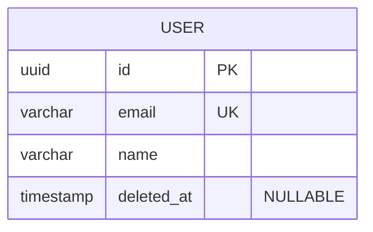
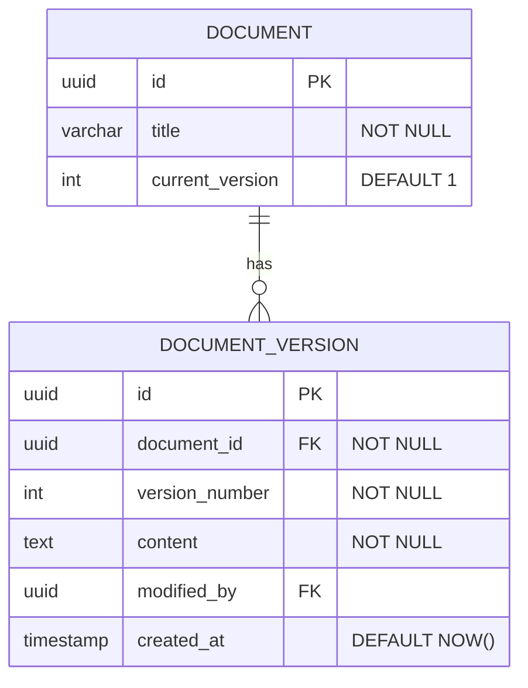

# Entity Relationship Diagrams - Patterns

Real-world schema examples, best practices, and common database design patterns.

<example name="Blog Platform">

## Blog Platform Schema

</example>

<example name="Social Media">

## Social Media Schema

</example>

## Best Practices

1. **Name entities in UPPERCASE singular** - `USER` not `USERS`, `ORDER` not `ORDERS`.
2. **Mark every constraint** - Add `PK`, `FK`, `UK`, and `"NOT NULL"` on every column that has them. Missing constraints are invisible bugs.
3. **Specify exact cardinality** - Use `||--o{` (one-to-many) vs `}o--o{` (many-to-many). Wrong cardinality misleads schema reviews.
4. **Add `created_at` and `updated_at` timestamps** to every table for audit trails.
5. **Model many-to-many with an explicit junction table** - Show the join entity with its own attributes (e.g., `enrolled_date` on `ENROLLMENT`).
6. **Mark computed columns with `"COMPUTED"`** so readers know they are derived, not stored.

## Common Patterns

<example name="Self-Referencing">

### Self-Referencing (Hierarchical)

</example>

<example name="Junction Table">

### Junction Table (Many-to-Many)

</example>

<example name="Polymorphic">

### Polymorphic Relationship

</example>

<example name="Soft Deletes">

### Soft Deletes

</example>

<example name="Audit Trail">

### Audit Trail

</example>

