# Flowcharts - Basics

Flowcharts visualize processes, algorithms, decision trees, and user journeys. They show step-by-step progression through a system or workflow.

<example name="Basic Syntax">

## Basic Syntax


**Directions:**
- `TD` or `TB` - Top to Bottom (default)
- `BT` - Bottom to Top
- `LR` - Left to Right
- `RL` - Right to Left

</example>

## Node Shapes

<example name="Rectangle">

### Rectangle (default)
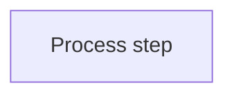

</example>

<example name="Stadium">

### Stadium/Pill Shape
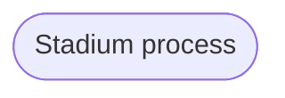

</example>

<example name="Rounded Rectangle">

### Rounded Rectangle


</example>

<example name="Subroutine">

### Subroutine (Double Border)
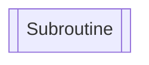

</example>

<example name="Database">

### Cylindrical (Database)
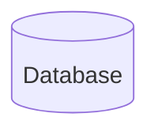

</example>

<example name="Circle">

### Circle
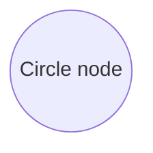

</example>

<example name="Flag">

### Asymmetric/Flag
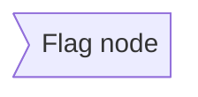

</example>

<example name="Decision">

### Rhombus (Decision)
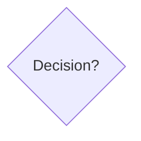

</example>

<example name="Hexagon">

### Hexagon
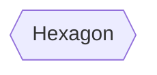

</example>

<example name="Parallelogram">

### Parallelogram (Input/Output)
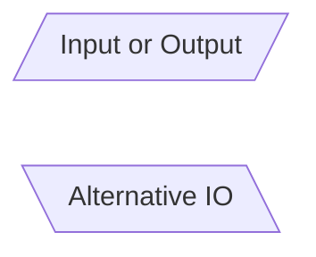

</example>

<example name="Trapezoid">

### Trapezoid
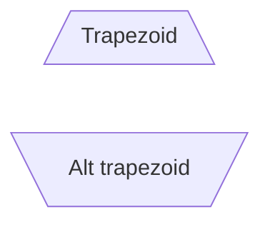

</example>

## Connections

<example name="Basic Arrow">

### Basic Arrow
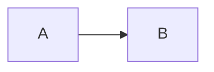

</example>

<example name="Open Link">

### Open Link (No Arrow)
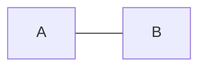

</example>

<example name="Text on Links">

### Text on Links
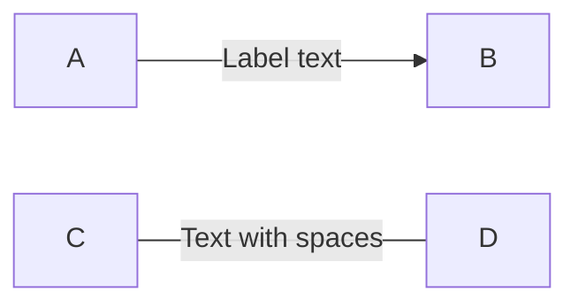

</example>

<example name="Dotted Links">

### Dotted Links
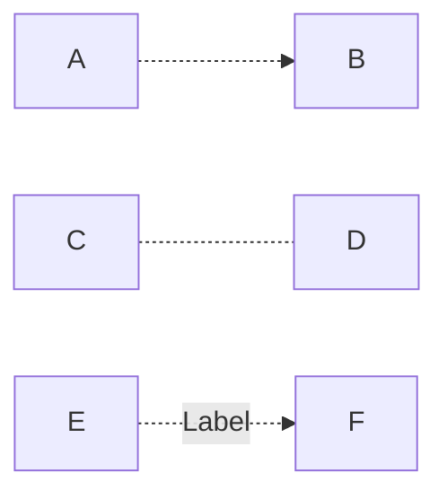

</example>

<example name="Thick Links">

### Thick Links
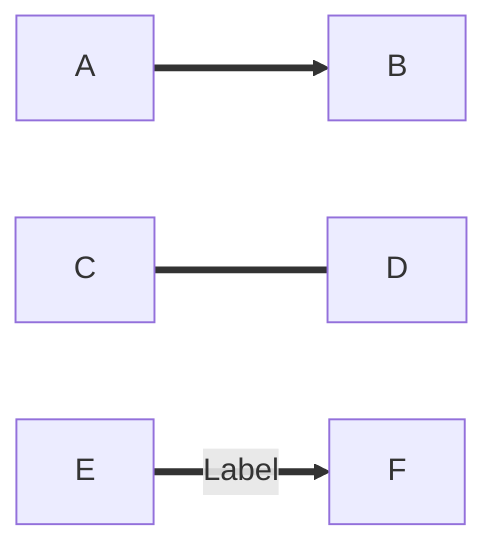

</example>

<example name="Chaining">

### Chaining
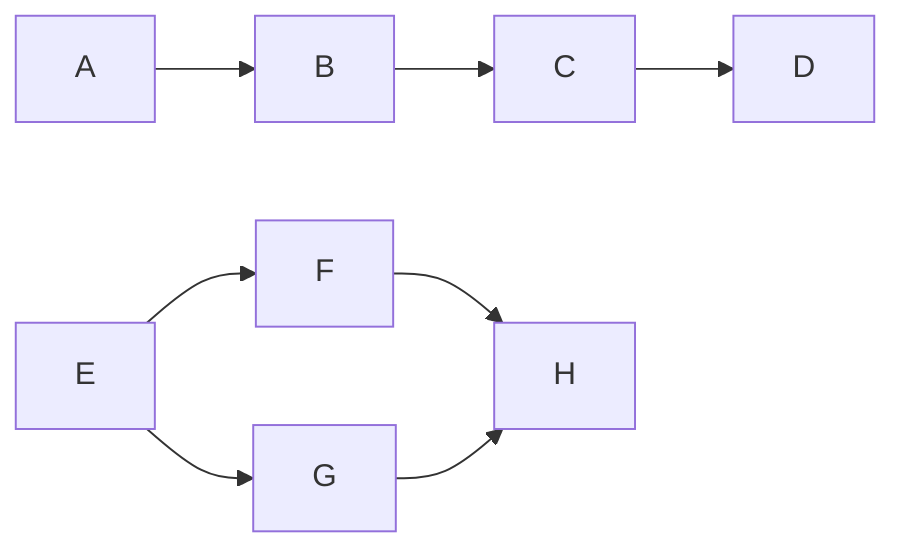

</example>

<example name="Multi-directional">

### Multi-directional
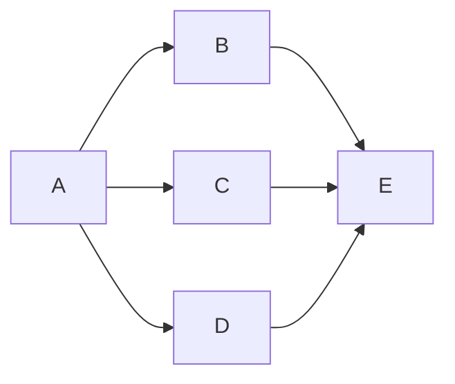

</example>

<example name="Subgraphs">

## Subgraphs

Group related nodes:

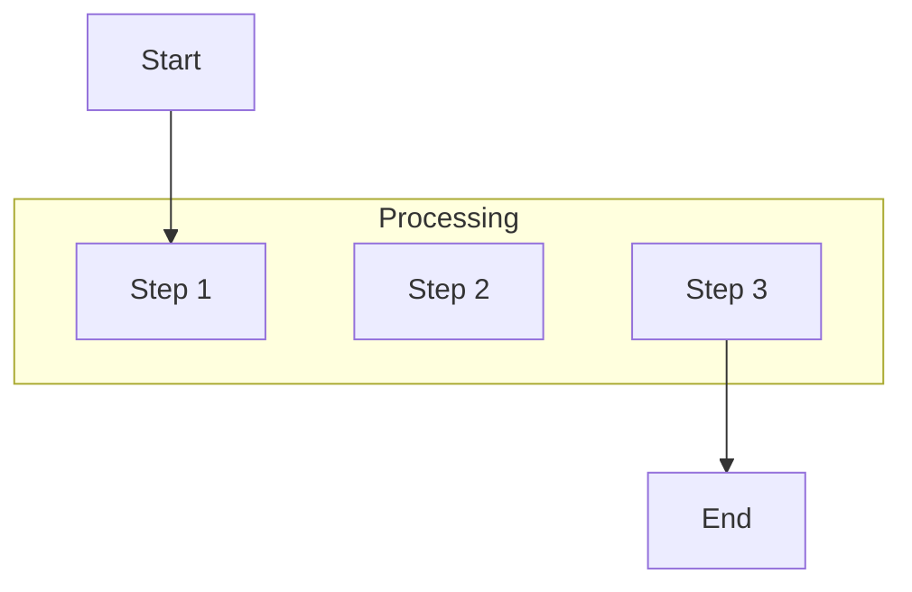

</example>

<example name="Nested Subgraphs">

### Nested Subgraphs
```mermaid
flowchart TB
    subgraph Outer
        A[Node A]

        subgraph Inner
            B[Node B]
            C[Node C]
        end
    end
```

</example>

<example name="Subgraph Direction">

### Subgraph Direction
```mermaid
flowchart LR
    subgraph one
        direction TB
        A1 --> A2
    end

    subgraph two
        direction TB
        B1 --> B2
    end

    one --> two
```

</example>
