# Other Diagram Types

State diagrams, git graphs, gantt charts, and pie/quadrant charts for specialized visualization needs.

## State Diagrams

State diagrams model state machines, showing states and transitions. Ideal for modeling object lifecycles, UI states, or workflow status.

<example name="Basic State">

### Basic Syntax
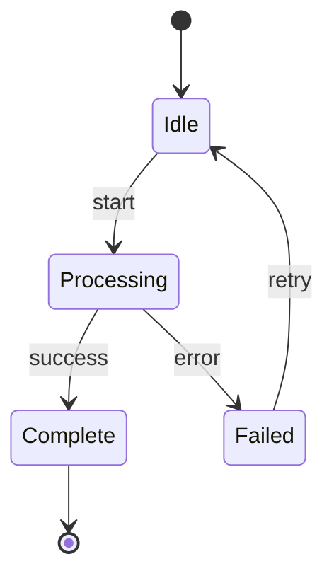

</example>

<example name="Composite States">

### Composite States
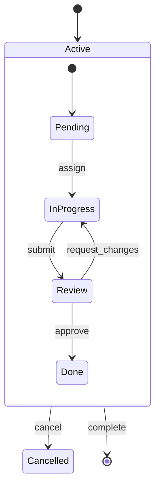

</example>

<example name="Order Lifecycle">

### Order Lifecycle Example
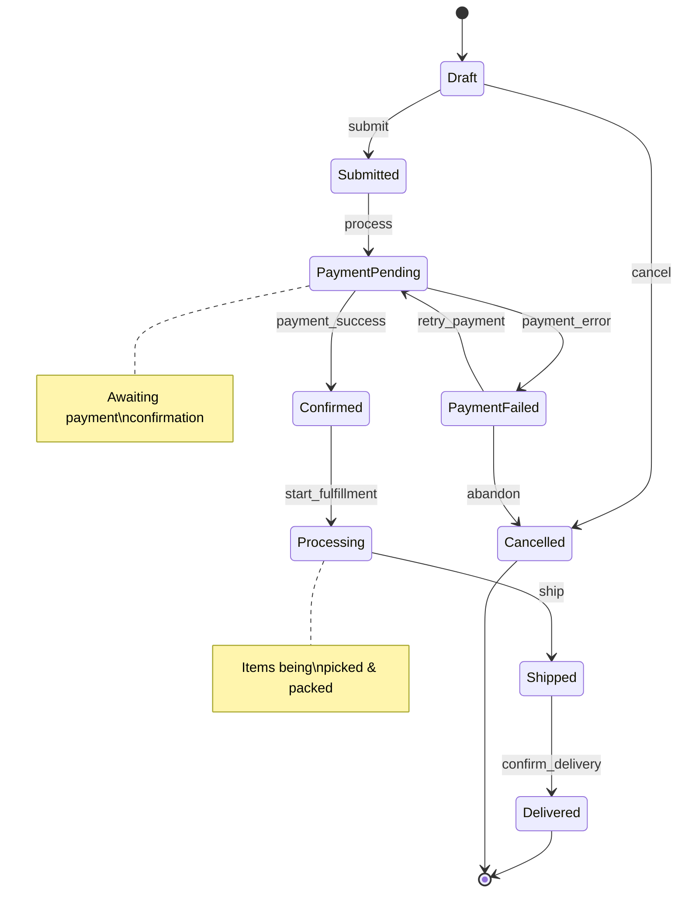

</example>

<example name="Concurrent States">

### Concurrent States (Fork/Join)
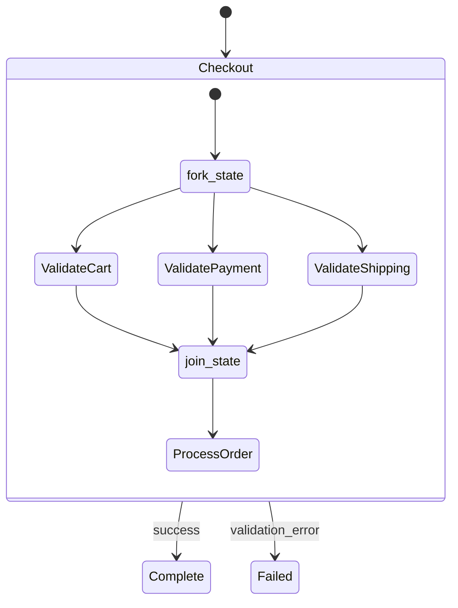

</example>

## Git Graphs

Git graphs visualize branching strategies and commit history. Useful for documenting Git workflows.

<example name="Basic Git Graph">

### Basic Syntax
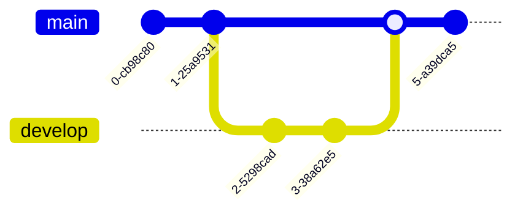

</example>

<example name="Feature Branch">

### Feature Branch Workflow
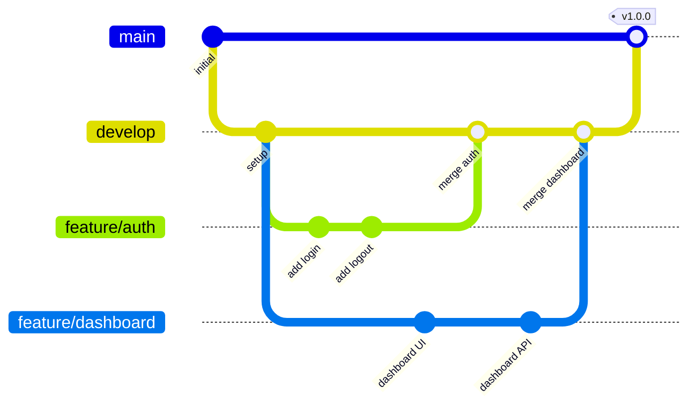

</example>

<example name="GitFlow">

### GitFlow Workflow
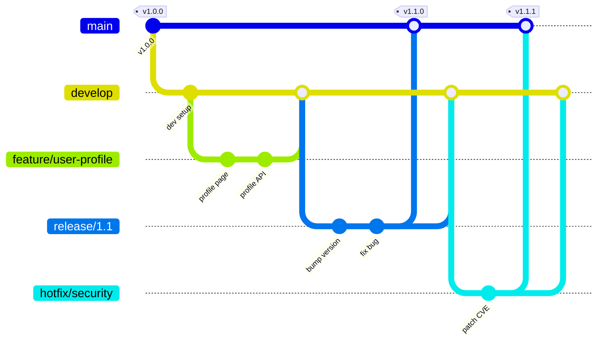

</example>

## Gantt Charts

Gantt charts visualize project timelines, task dependencies, and milestones. Essential for project planning.

<example name="Basic Gantt">

### Basic Syntax
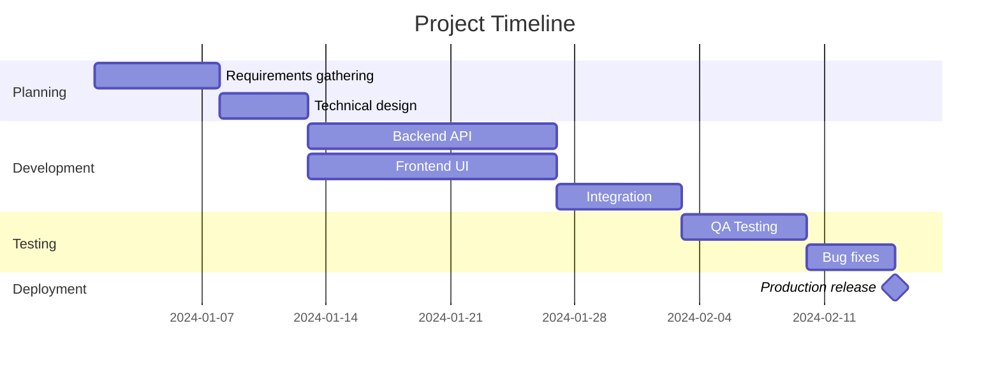

</example>

<example name="Sprint Planning">

### Sprint Planning
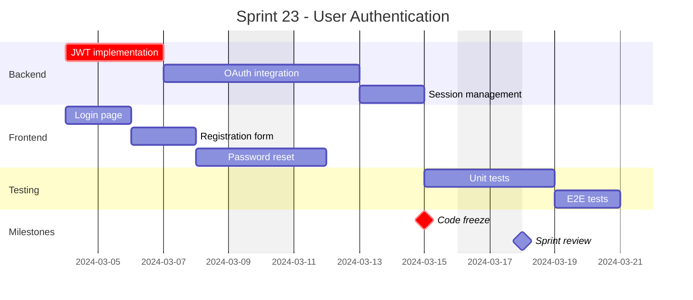

</example>

<example name="Product Roadmap">

### Product Roadmap
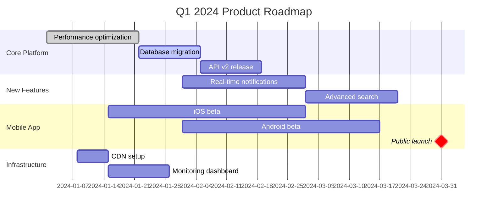

</example>

## Pie Charts

Pie charts show proportional data distribution. Use for simple percentage breakdowns.

<example name="Basic Pie">

### Basic Syntax
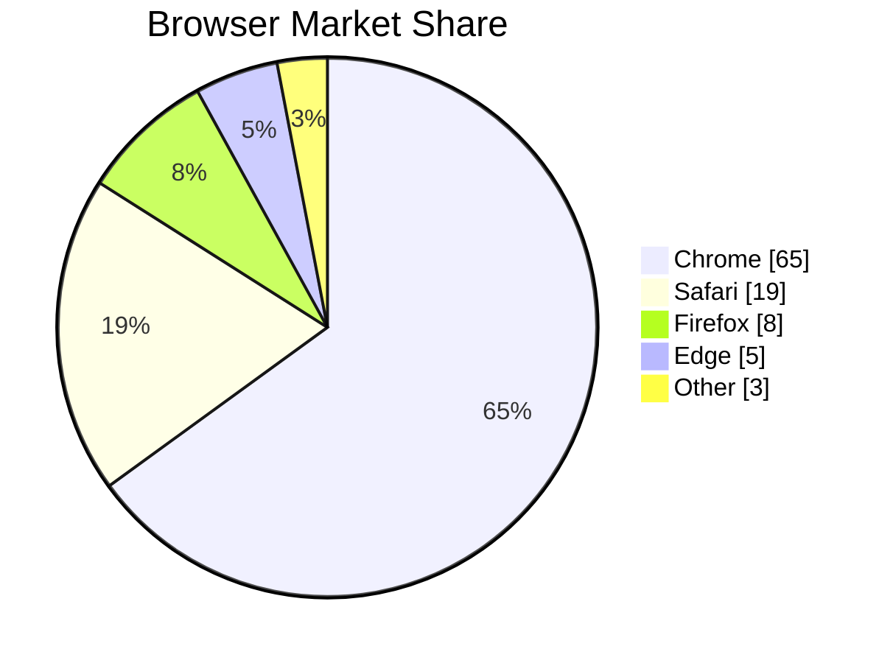

</example>

<example name="Sprint Breakdown">

### Sprint Work Breakdown
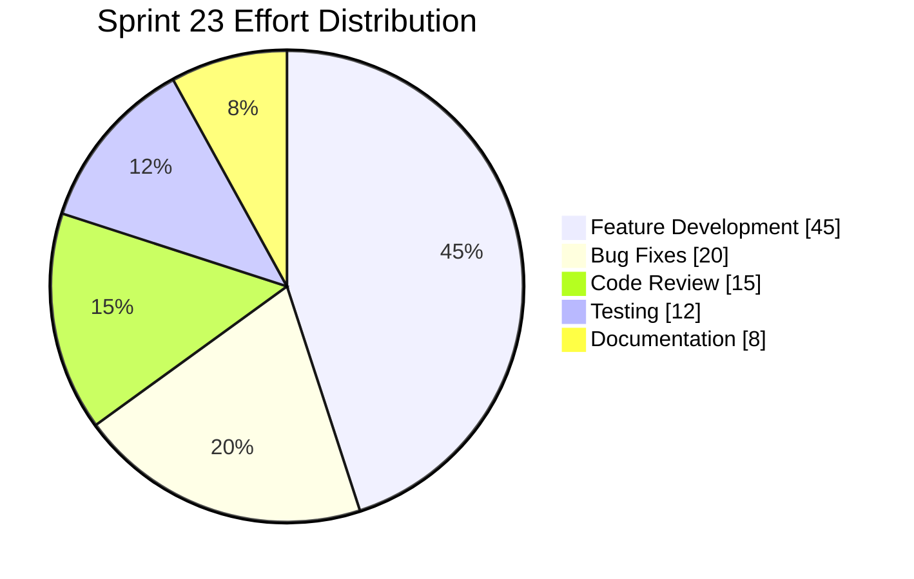

</example>

## Quadrant Charts

Quadrant charts plot items on two axes for prioritization and analysis.

<example name="Basic Quadrant">

### Priority Matrix
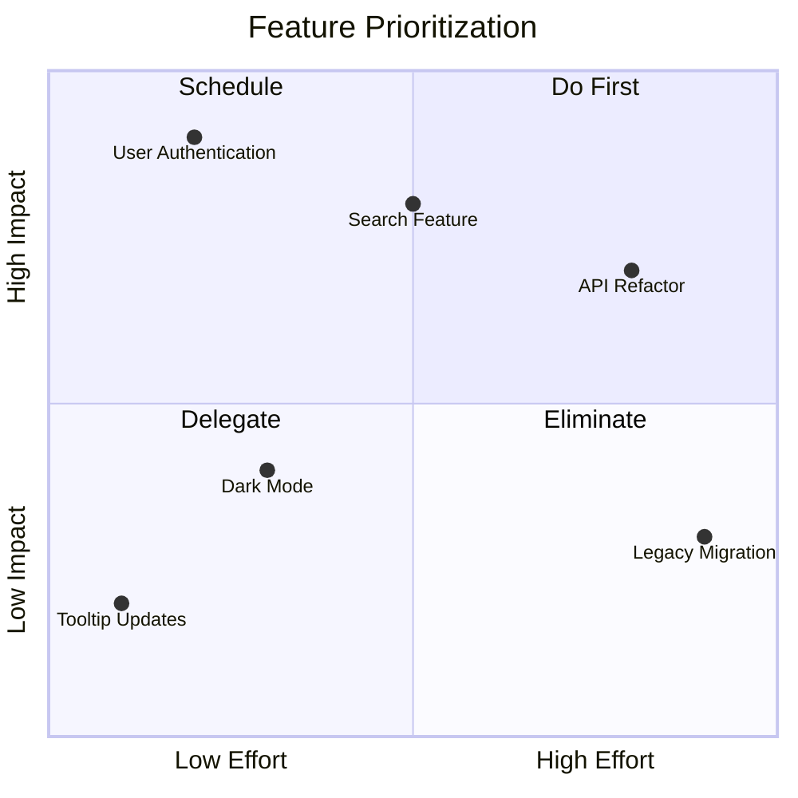

</example>

<example name="Tech Debt">

### Technical Debt Assessment
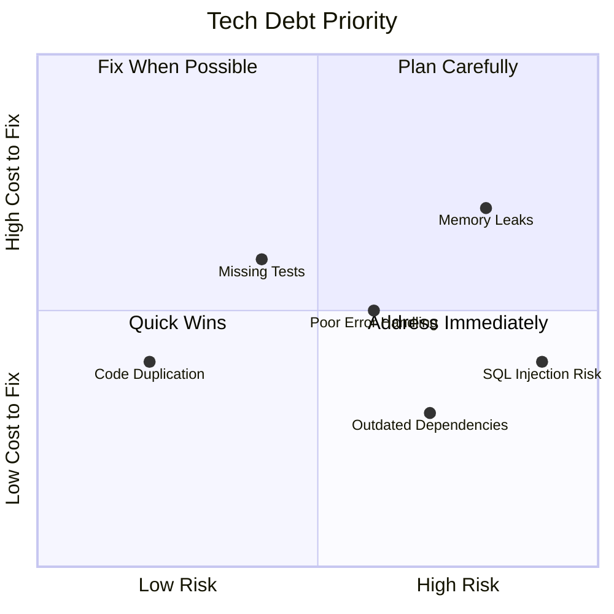

</example>

## Best Practices by Diagram Type

### State Diagrams
- Begin every diagram with `[*] --> InitialState` and end with `FinalState --> [*]`.
- Label every transition with the trigger event name (e.g., `: submit`, `: cancel`).
- Wrap 3+ related states in a `state` composite block and name it after the lifecycle phase.
- Add `note right of StateName` to explain non-obvious transition guards.

### Git Graphs
- Set `id:` on every commit to a short descriptive label (e.g., `id: "add auth"`).
- Tag release commits on main with `tag: "v1.0.0"`.
- Name branches with the `type/name` convention (e.g., `feature/auth`, `hotfix/security`).

### Gantt Charts
- Add `excludes weekends` for realistic timelines.
- Mark critical path tasks with `crit` and key dates with `milestone`.
- Group tasks into `section` blocks named after project phases.
- Use `after taskId` for dependencies rather than hardcoded dates where possible.

### Pie/Quadrant Charts
- Cap pie charts at 5-7 segments. Merge small slices into "Other".
- Add `showData` to every pie chart so values are visible.
- Label all four quadrants with actionable names (e.g., "Do First", "Eliminate").
