# Theming and Styling

Visual customization for Mermaid diagrams including themes, colors, and styling options.

<example name="Frontmatter Configuration">

## Frontmatter Configuration

Add YAML configuration at the top of diagrams:

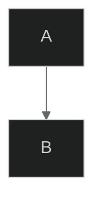

</example>

## Themes

### Built-in Themes

```mermaid
---
config:
  theme: default
---
```

**Available themes:**
- `default` - Standard blue theme
- `forest` - Green earth tones
- `dark` - Dark mode friendly
- `neutral` - Grayscale professional
- `base` - Minimal base theme for customization

<example name="Default Theme">

### Theme Examples

**Default Theme:**
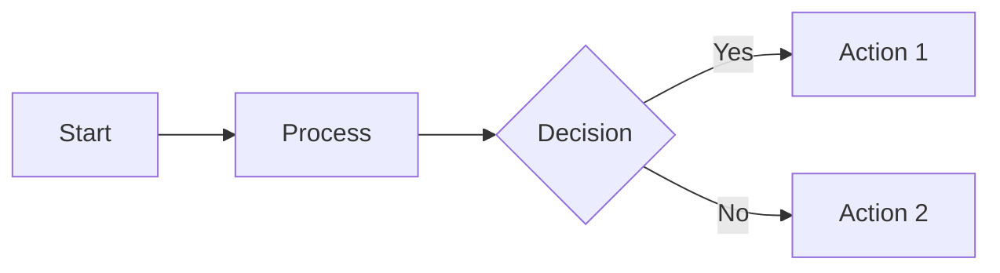

</example>

<example name="Dark Theme">

**Dark Theme:**
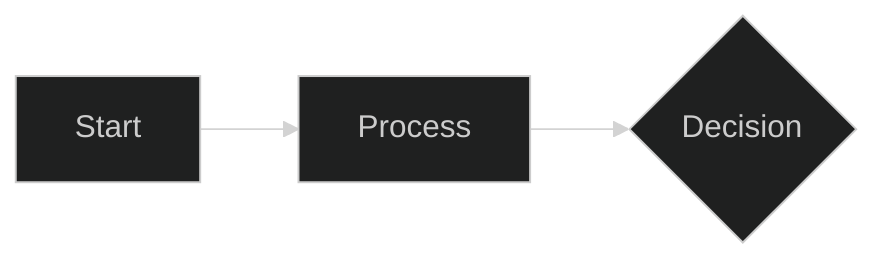

</example>

<example name="Forest Theme">

**Forest Theme:**
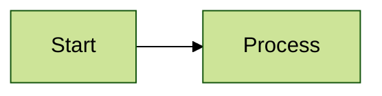

</example>

<example name="Custom Theme Variables">

## Custom Theme Variables

Override specific colors:

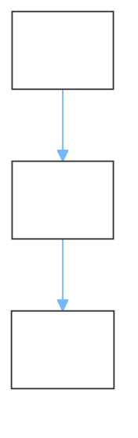

</example>

<example name="Class-based Styling">

## Diagram-Specific Styling

### Flowchart Styling

**Class-based styling:**
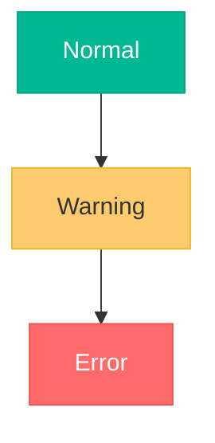

</example>

<example name="Node-specific Styling">

**Node-specific styling:**
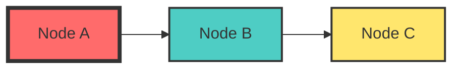

</example>

<example name="Link Styling">

**Link styling:**
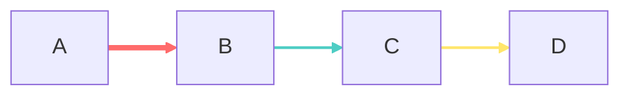

</example>

<example name="Sequence Diagram Styling">

### Sequence Diagram Styling

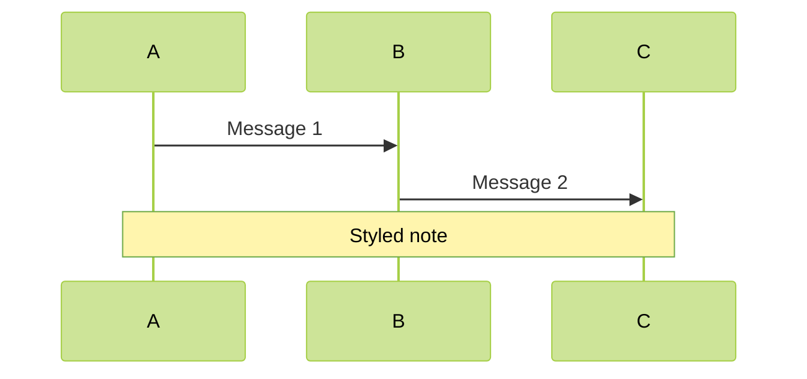

</example>

<example name="Class Diagram Styling">

### Class Diagram Styling

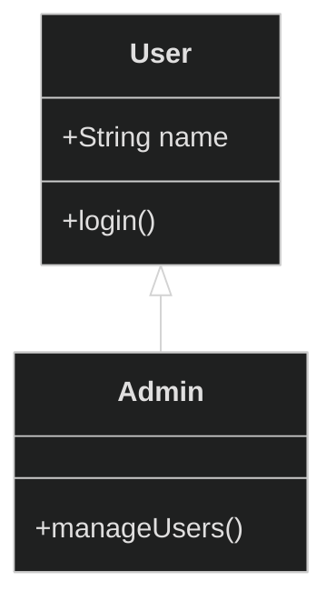

</example>

<example name="Subgraph Styling">

## Subgraph Styling

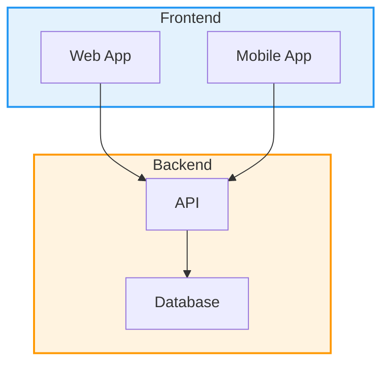

</example>

<example name="Complex Styling">

## Complex Styling Example

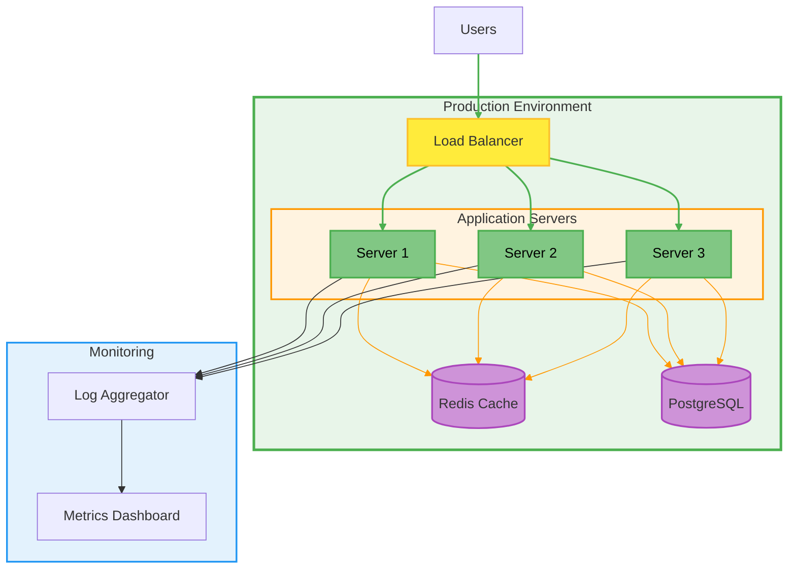

</example>

<example name="Accessible Styling">

## Accessibility Considerations

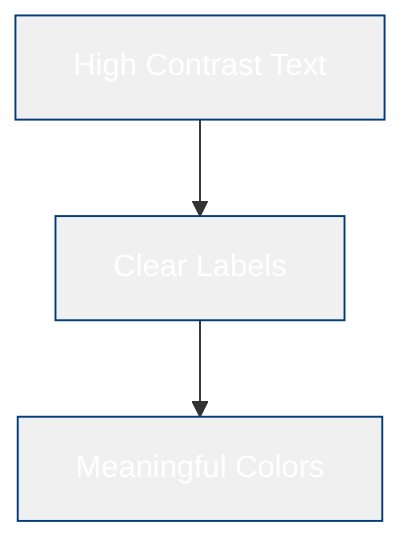

**Accessibility tips:**
- Use high contrast color combinations
- Don't rely solely on color to convey meaning
- Include descriptive text labels
- Test with color blindness simulators
- Consider dark mode alternatives

</example>

## Best Practices for Theming

1. **Use themes consistently** - Pick one theme for related diagrams
2. **Don't over-style** - Too many colors can reduce clarity
3. **Test hand-drawn look** - Some diagrams work better with classic look
4. **Keep it accessible** - Ensure sufficient color contrast
5. **Version control configs** - Track theme changes in your repository
